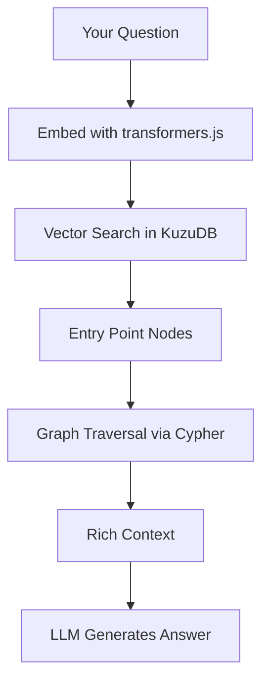
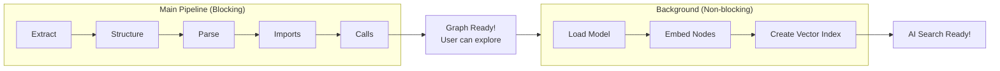
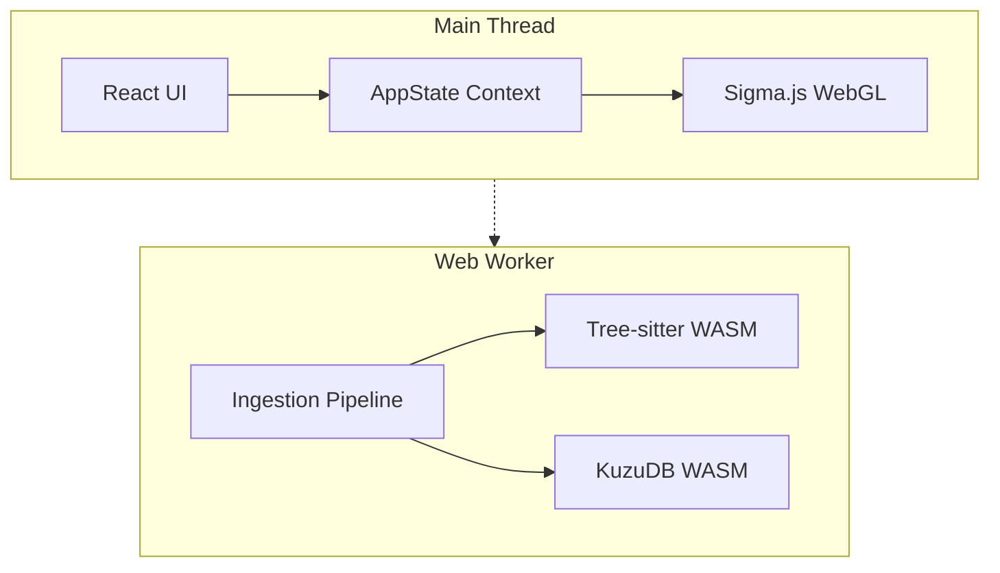
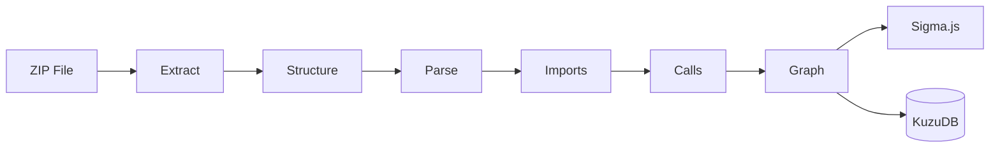
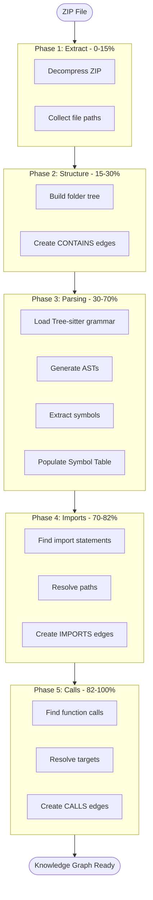
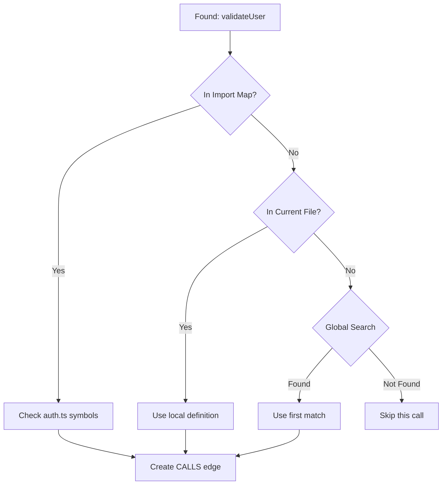
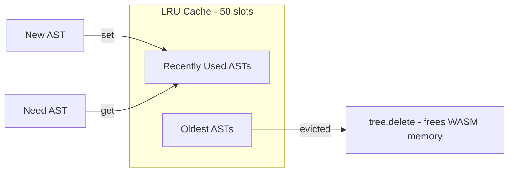
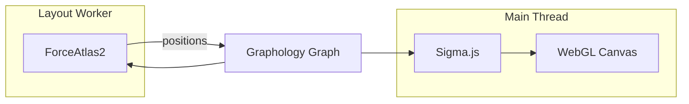
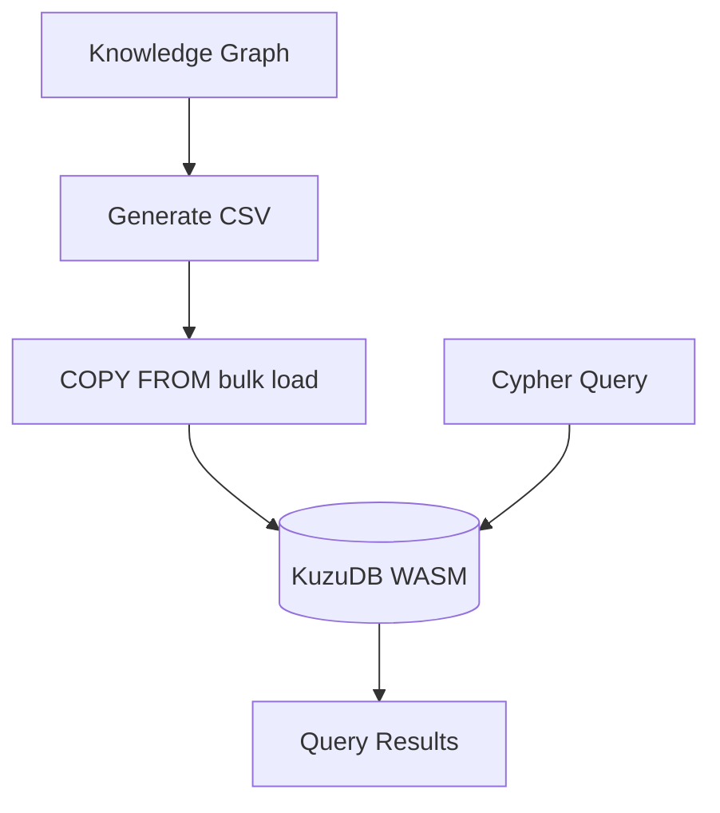
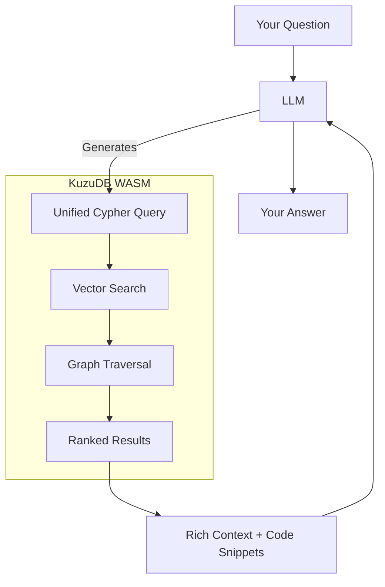

# GitNexus V2 - Client-Side Knowledge Graph Generator

> Privacy-focused, zero-server knowledge graph generator that runs entirely in your browser.

Transform codebases into interactive knowledge graphs using AST parsing, Web Workers, and an embedded KuzuDB WASM database. All processing happens locally - your code never leaves your machine.

**Next up:** Browser-based embeddings + Graph RAG. The cool part? KuzuDB supports native vector indexing, so we can do semantic search AND graph traversal in a single Cypher query. No separate vector DB needed. See [Work in Progress](#-current-work-in-progress) for the full plan.


https://github.com/user-attachments/assets/f375b00a-78cd-4f93-a96c-9ba924455f49


---

## 🚧 Current Work in Progress

**Actively Building:**

- [ ] **Graph RAG Agent** - AI chat with Cypher query generation for intelligent code exploration
- [ ] **Browser Embeddings** - Small embedding model for semantic node search (see below!)
- [ ] **Multi-Worker Pool** - Parallel parsing across multiple Web Workers (currently using single worker)
- [ ] **Ollama Support** - Local LLM integration
- [ ] **CSV Export** - Export node/relationship tables

### 🧠 Graph RAG: The Plan

Here's what we're building for the AI layer. The goal: ask questions in plain English, get answers backed by actual graph traversal + semantic understanding.

**The Problem:** A regular LLM doesn't know your codebase. It can't tell you what calls `handleAuth` or what breaks if you change `UserService`. You need to give it tools to explore the graph.

**The Solution:** Combine embeddings (for "find relevant code by meaning") with graph queries (for "trace connections").



**Embedding Model:** We're going with `snowflake-arctic-embed-xs` - a tiny 22M parameter model that runs entirely in the browser via [transformers.js](https://huggingface.co/docs/transformers.js). It outputs 384-dimensional vectors and scores 50.15 on MTEB (comparable to models 5x its size). The model downloads once (~90MB), gets cached, and runs locally forever. Privacy intact. ✅

**The Pipeline:**



The idea: you can start exploring the graph immediately after Phase 5. Meanwhile, embeddings are generated in the background. Once done, semantic search unlocks.

### 💡 A Fun Discovery: Unified Vector + Graph = Superpowers

While designing this, I stumbled onto something cool. Most Graph RAG systems use **separate databases** - a vector DB (Pinecone, Qdrant) for semantic search and a graph DB (Neo4j) for traversal. This means the LLM has to:

1. Call vector search → get IDs
2. Take those IDs → call graph DB
3. Coordinate between two systems

But KuzuDB WASM supports **native vector indexing** (HNSW). Which means we can do vector search AND graph traversal **in a single Cypher query**:

```cypher
-- Find code similar to "authentication" AND trace what calls it
-- ALL IN ONE QUERY! 🤯
CALL QUERY_VECTOR_INDEX('CodeNode', 'embedding_idx', $queryVector, 10)
WITH node AS match, distance
WHERE distance < 0.4
MATCH (caller:CodeNode)-[r:CodeRelation {type: 'CALLS'}]->(match)
RETURN match.name AS found, 
       caller.name AS called_by,
       distance AS relevance
ORDER BY distance
```

This is kind of a big deal. Here's why:

**Traditional approach (2 queries, 2 systems):**
```
semantic_search("auth") → ["id1", "id2", "id3"]
                              ↓
graph_query("MATCH ... WHERE id IN [...]") → results
```

**Unified KuzuDB approach (1 query, 1 system):**
```
cypher("CALL QUERY_VECTOR_INDEX(...) WITH node MATCH (node)-[...]->() ...") → results
```

And because `distance` comes back with every result, we get **built-in reranking for free**:

```cypher
-- The LLM can dynamically control relevance thresholds!
CALL QUERY_VECTOR_INDEX('CodeNode', 'idx', $vec, 20)
WITH node, distance,
     CASE 
       WHEN distance < 0.15 THEN 'exact_match'
       WHEN distance < 0.30 THEN 'highly_relevant'
       ELSE 'related'
     END AS tier
WHERE distance < 0.5
MATCH (node)-[*1..2]-(context)
RETURN node.name, tier, collect(context.name) AS related
ORDER BY distance
```

**What this enables:**
- 🎯 **Single query execution** - No round trips between systems
- 📊 **Hierarchical relevance** - LLM sees exact matches vs related vs weak
- 🌳 **Weighted expansion** - Traverse further from better matches
- ⚡ **Dynamic thresholds** - LLM adjusts `WHERE distance < X` per question type
- 🔄 **No reranker needed** - Distance IS the relevance score

Basically, the LLM gets to write one smart query that does semantic search, filters by relevance, expands via graph relationships, and returns ranked results. No separate reranker model, no vector DB API calls, no coordination logic. Just Cypher.

Still wrapping my head around all the query patterns this unlocks, but I'm pretty excited about it.

---

## ⚡ What's New in V2

V2 is a major refactor focused on **performance** and **scalability**. Here's what changed and why it matters:

### 🎨 Sigma.js Replaces D3.js (10,000+ nodes without breaking a sweat)

V1 used D3.js force simulation which worked great for small graphs, but started choking around 2-3k nodes. The browser would freeze, fans would spin, and you'd be staring at a loading spinner.

**V2 uses Sigma.js with WebGL rendering.** This means the GPU does the heavy lifting instead of JavaScript. We've tested graphs with 10k+ nodes and they render smoothly. Pan, zoom, click - all buttery smooth.

The layout algorithm also moved to **ForceAtlas2 running in a Web Worker**, so your UI stays responsive while the graph positions itself.

### 🗂️ Dual HashMap Symbol Table (Goodbye Trie, Hello Speed)

In V1, we used a **Trie** (prefix tree) to store function/class definitions. It was clever - you could do fuzzy lookups and autocomplete. But it was also slow and memory-hungry for large codebases.

V2 uses a simpler but faster **Dual HashMap** approach:

```
File-Scoped Index:  Map<FilePath, Map<SymbolName, NodeID>>
Global Index:       Map<SymbolName, SymbolDefinition[]>
```

**Why two maps?** When resolving a function call like `handleAuth()`, we first check if it's defined in a file we imported (high confidence). If not, we check the current file. As a last resort, we search globally (useful for framework magic like FastAPI's `@app.get` decorators where the connection isn't explicit in imports).

This change alone gave us **~2x speedup** on the parsing phase.

### 💾 LRU Cache for AST Trees (Memory That Cleans Itself)

Tree-sitter generates AST (Abstract Syntax Tree) objects that live in WASM memory. In V1, we'd keep all of them around, which meant memory usage grew linearly with file count. Parse 5000 files? That's 5000 AST objects eating RAM.

V2 uses an **LRU (Least Recently Used) cache** with a cap of 50 entries. When we need to parse file #51, the oldest unused AST gets evicted and we call `tree.delete()` to free the WASM memory.

The clever part: we parse files in Phase 3, then reuse those ASTs in Phase 4 (imports) and Phase 5 (calls). The LRU cache keeps recently-parsed files hot, so we rarely need to re-parse.

### 📊 Overall Results

| Metric               | V1                    | V2                  | Improvement |
| -------------------- | --------------------- | ------------------- | ----------- |
| Max renderable nodes | ~3,000                | 10,000+             | ~3x+        |
| Parse speed          | Baseline              | 3-5x faster         | ⚡          |
| Memory usage         | Grows unbounded       | Capped by LRU       | Stable      |
| UI responsiveness    | Freezes during layout | Smooth (Web Worker) | ✅          |

**Note:** V2 currently uses a single Web Worker. Multi-worker support is planned and should give another 2-4x speedup on multi-core machines.

---

## Project Focus

- **Privacy-first**: Zero-cost, zero-server tool to create knowledge graphs from codebases entirely within the browser
- **Human + AI friendly**: Knowledge graphs useful for both manual exploration and AI agent context retrieval
- **Fast & cheap**: Browser-based indexing is faster and cheaper than embedding models + vector RAG
- **Understanding codebases**: Graph visualization + Graph RAG chatbot for accurate context retrieval

## AI Use Cases

- **Blast radius analysis**: Compute impact of function/module changes, enumerate affected endpoints/tests
- **Fault isolation**: Start from a failing symbol, traverse callers/callees to isolate the fault line faster than grep or embeddings
- **Code health**: Detect orphaned nodes, unresolved imports, unused functions with simple graph queries
- **Auditing**: Spot forbidden dependencies or layer violations quickly during onboarding or security reviews

---

## Features

**Code Analysis**

- Analyze ZIP files containing codebases
- TypeScript, JavaScript, Python support
- Interactive WebGL graph visualization with Sigma.js
- Real-time Cypher queries against in-browser graph database

**Processing**

- 5-phase pipeline: Extract → Structure → Parsing → Imports → Calls
- Web Worker offloading (single worker, multi-worker planned)
- Tree-sitter WASM for AST parsing
- LRU cache with automatic WASM memory cleanup

**Privacy**

- 100% client-side - no server, no uploads
- API keys stored in localStorage only
- Open source and auditable

---

## Architecture

### V1 vs V2 Comparison

| Aspect        | V1                                | V2                                   |
| ------------- | --------------------------------- | ------------------------------------ |
| Code Style    | Class-based                       | Function-based (factory pattern)     |
| Symbol Lookup | Trie data structure               | Dual HashMap (file-scoped + global)  |
| Visualization | D3.js force simulation            | Sigma.js + WebGL + ForceAtlas2       |
| Workers       | Worker pool with Comlink          | Single worker (multi-worker planned) |
| AI Pipeline   | LangChain ReAct agents            | Not yet implemented (WIP)            |
| Layout        | D3 force simulation (main thread) | ForceAtlas2 (Web Worker)             |

### System Overview



Think of it like this: the main thread handles what you see (React UI, graph rendering), while the Web Worker does all the heavy computation (parsing, database queries) in the background. They communicate through Comlink, which makes calling worker functions feel like regular async calls.

### Data Flow



---

## 5-Phase Ingestion Pipeline

Here's what happens when you drop a ZIP file:



### What Each Phase Does

**Phase 1: Extract** - We use JSZip to decompress your ZIP file and store all file contents in a Map. Simple but necessary.

**Phase 2: Structure** - We walk through all file paths and build a tree of folders and files. A path like `src/components/Button.tsx` creates nodes for `src`, `components`, and `Button.tsx` with `CONTAINS` relationships connecting them.

**Phase 3: Parsing** - This is where the magic happens. Tree-sitter parses each file into an AST, and we extract all the interesting bits: functions, classes, interfaces, methods. These get stored in our Symbol Table for later lookup.

**Phase 4: Imports** - We find all `import` and `require` statements and figure out which files they point to. `import { foo } from './utils'` might resolve to `./utils.ts`, `./utils/index.ts`, etc. We try common extensions until we find a match.

**Phase 5: Calls** - The trickiest phase. We find all function calls and try to figure out what they're calling. We use our resolution strategy (import map → local → global) to link calls to their definitions.

---

## Symbol Resolution: How We Link Function Calls

When we see code like this:

```typescript
import { validateUser } from './auth';

function login() {
  validateUser(email, password);  // ← What does this call?
}
```

We need to figure out that `validateUser()` refers to the function defined in `./auth.ts`. Here's our strategy:



**Why the global fallback?** Some frameworks use "magic" that doesn't show up in imports. For example, FastAPI:

```python
@app.get("/users")
def get_users():
    return db.query(User)  # Where does 'db' come from?
```

The `db` object might be injected by the framework, not explicitly imported. Our global search catches these cases (with lower confidence).

---

## LRU AST Cache

Parsing files into ASTs is expensive, and AST objects live in WASM memory (which doesn't get garbage collected like regular JS objects). We use an LRU cache to keep memory bounded:



**How it helps:**

- Phase 3 parses files and stores ASTs in cache
- Phase 4 & 5 reuse cached ASTs (no re-parsing!)
- If cache is full, oldest AST is evicted and WASM memory is freed
- Result: Memory stays bounded even for huge codebases

---

## Graph Visualization

### Sigma.js + ForceAtlas2



**Why this combo works:**

- **Sigma.js** uses WebGL to render nodes/edges on the GPU - handles 10k+ nodes easily
- **ForceAtlas2** is a physics-based layout that runs in a Web Worker - UI stays responsive
- **Graphology** is the data structure holding the graph - fast lookups and updates

**Visual features:**

- Nodes sized by type (folders bigger than files, files bigger than functions)
- Edges colored by relationship (green for CONTAINS, blue for IMPORTS, purple for CALLS)
- Click a node to highlight its connections
- Pan/zoom with mouse, reset view button

---

## KuzuDB Integration

We load the graph into KuzuDB (an embedded graph database) so you can run Cypher queries:



**Example queries you can run:**

```cypher
-- Find all functions in a file
MATCH (f:CodeNode {label: 'File', name: 'App.tsx'})-[:CodeRelation]->(fn:CodeNode {label: 'Function'})
RETURN fn.name

-- Find what imports a specific file
MATCH (f:CodeNode)-[r:CodeRelation {type: 'IMPORTS'}]->(target:CodeNode {name: 'utils.ts'})
RETURN f.name
```

**Status:**

- ✅ KuzuDB WASM initialization
- ✅ Polymorphic schema (single node/edge tables)
- ✅ CSV generation and bulk loading
- ✅ Cypher query execution
- 🚧 Vector embeddings + HNSW index (WIP)
- 🚧 Graph RAG agent (WIP)

---

## Tech Stack

- **Frontend**: React 18 + TypeScript + Vite + Tailwind CSS v4
- **Visualization**: Sigma.js + Graphology + ForceAtlas2 (WebGL)
- **Parsing**: Tree-sitter WASM (TypeScript, JavaScript, Python)
- **Database**: KuzuDB WASM (in-browser graph database + vector index)
- **Concurrency**: Web Worker + Comlink
- **Caching**: lru-cache with WASM memory management
- **AI (WIP)**: transformers.js for browser embeddings, LangChain for agent orchestration

---

## Graph Schema

### Node Types

| Label         | Description          | Example            |
| ------------- | -------------------- | ------------------ |
| `Folder`    | Directory in project | `src/components` |
| `File`      | Source code file     | `App.tsx`        |
| `Function`  | Function definition  | `handleClick`    |
| `Class`     | Class definition     | `UserService`    |
| `Interface` | Interface definition | `Props`          |
| `Method`    | Class method         | `render`         |

### Relationship Types

| Type         | From   | To                  | Description         |
| ------------ | ------ | ------------------- | ------------------- |
| `CONTAINS` | Folder | File/Folder         | Directory structure |
| `DEFINES`  | File   | Function/Class/etc. | Code definitions    |
| `IMPORTS`  | File   | File                | Module dependencies |
| `CALLS`    | File   | Function/Method     | Function call graph |

---

## Getting Started

**Prerequisites**: Node.js 18+

```bash
git clone <repository-url>
cd gitnexus
npm install
npm run dev
```

Open http://localhost:5173

**Usage:**

1. Drag & drop a ZIP file containing your codebase
2. Wait for the 5-phase pipeline to complete
3. Explore the interactive graph
4. Click nodes to view code, filter by type, adjust depth

---

## Planned: AI Features

### Graph RAG Agent (WIP)

The idea: ask questions in plain English, get answers backed by graph queries + semantic understanding.



**Example interactions:**

- "What functions call `handleAuth`?" → Vector search finds `handleAuth`, Cypher traces callers
- "Show me the blast radius if I change `UserService`" → Finds service, traverses 3 hops of dependencies
- "How does authentication work in this codebase?" → Semantic search for auth-related code, returns connected components

**Why dynamic Cypher generation?** Originally we planned to use pre-built query templates (because LLMs can be... creative with syntax). But with the unified vector + graph approach, the LLM just needs to learn one pattern:

```cypher
CALL QUERY_VECTOR_INDEX(...) WITH node, distance
WHERE distance < [threshold]
MATCH (node)-[relationship pattern]->(connected)
RETURN [what you need]
ORDER BY distance
```

Give the LLM the schema, a few examples, and let it compose queries. The schema is simple enough that modern LLMs (GPT-4, Claude) handle it well. And if a query fails? The error message is usually clear enough for the LLM to self-correct.

---

## Security & Privacy

- All processing happens in your browser
- No code uploaded to any server
- API keys stored in localStorage only
- Open source - audit the code yourself

---

## Deployment

```bash
npm run build
npm run preview
```

The build outputs to `dist/` and can be served from any static hosting.

---

## License

MIT License

---

## Acknowledgments

- [Tree-sitter](https://tree-sitter.github.io/) - AST parsing
- [KuzuDB](https://kuzudb.com/) - Embedded graph database
- [Sigma.js](https://www.sigmajs.org/) - WebGL graph rendering
- [Graphology](https://graphology.github.io/) - Graph data structure
- [code-graph-rag](https://github.com/vitali87/code-graph-rag) - Reference implementation
